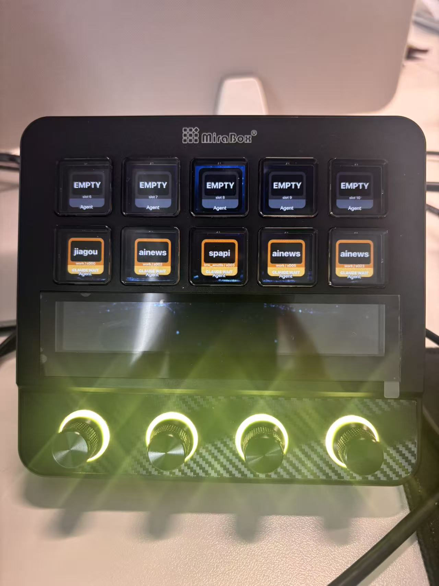
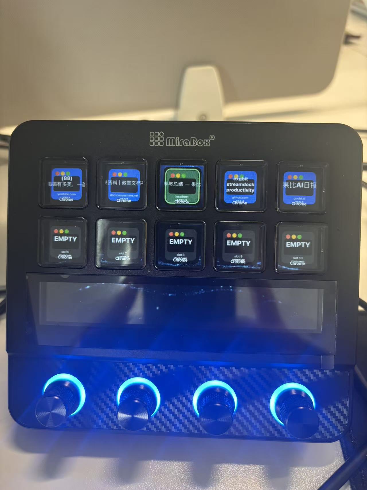

# Stream Dock 效率插件合集

这是一个面向 macOS Stream Dock 的插件合集，用于快速切换 AI Agent 终端和 Chrome 标签页。

## 包含内容

- `agent-switcher.sdPlugin`：监控 Codex / Claude Code 终端会话，显示项目名、运行状态，并点击切回对应终端。
- `chrome-tab-switcher.sdPlugin`：监控 Google Chrome 标签页，并点击切换到对应标签页。
- `scripts/agent-watch`：可选启动包装器，用于更可靠地记录 Codex / Claude 的 `RUN / WAIT / DONE / ERR` 状态。

## 安装

```bash
rsync -av agent-switcher.sdPlugin "$HOME/Library/Application Support/HotSpot/StreamDock/plugins/"
rsync -av chrome-tab-switcher.sdPlugin "$HOME/Library/Application Support/HotSpot/StreamDock/plugins/"
mkdir -p "$HOME/.local/bin"
rsync -av scripts/agent-watch "$HOME/.local/bin/agent-watch"
```

安装或更新后，请重启 Stream Dock。

## Agent Switcher

在 Stream Dock 上放置多个 `Agent Slot` 按键。每个按键会保存一个固定的槽位编号，因此可以跨多个页面放更多按键。



图标分为两个区域：

- 上半部分：Agent 类型颜色，Codex 为蓝色，Claude 为亚麻/橙色。
- 下方状态条：运行状态颜色，`RUN` 为绿色，`WAIT` 为黄色，`DONE` 为灰色，`ERR` 为红色。

图标中间主要显示项目目录名。按下按键时，会尽量切换到对应的 Terminal / iTerm 会话。

如果希望状态识别更可靠，建议通过 wrapper 启动新的会话：

```bash
agent-watch claude
agent-watch codex resume
```

wrapper 会把状态写入：

```text
~/.agent-watch/sessions/
```

Agent Switcher 会优先读取这些状态文件。

## Chrome Tab Switcher

在 Stream Dock 上放置多个 `Chrome Tab Slot` 按键。插件会通过 AppleScript 定时读取 Chrome 的窗口和标签页。



按键会显示标签页标题和域名。按下按键时，会激活对应的 Chrome 窗口和标签页。

## 注意事项

- Stream Dock 插件不能自己创建物理按键位置。你需要先在一个或多个页面上放置足够的 slot action。
- 如果复制已有按键，Stream Dock 可能会复制它保存的槽位编号。插件会自动修复当前可见页面中的重复槽位。
- macOS 可能会提示授予 Automation 权限，用于控制 Terminal、iTerm2 或 Google Chrome。
